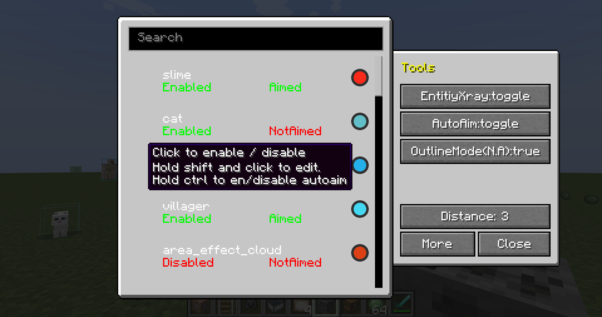

# Entity auto-Aiming and XRay (Forge Edition for Minecraft 1.19.1)

Just like Advanced-XRay Mod but for entities. I learned a lot from that code and because of laziness I build the two mod together so that you may find XRay mod in it.

Now the Autoaim entities function is newly added,btw thanks for the aimassistant mod where I learned a lot.But this mod is more suitable for gun fighting(like zombies game).

## Key binding: 
H for GUI and J for toggling(J key is not necessary now but I kept it)

## Todo:
I want to build entityXray like Entityoutliner mod but feel ignornant when comes to OpenGl rendering.Maybe I will spend some time learning things but not playing with mods.

Also There's an to be added function in the autoaim part that is to amend the delay in mc servers.It doesn't do any effect now.

