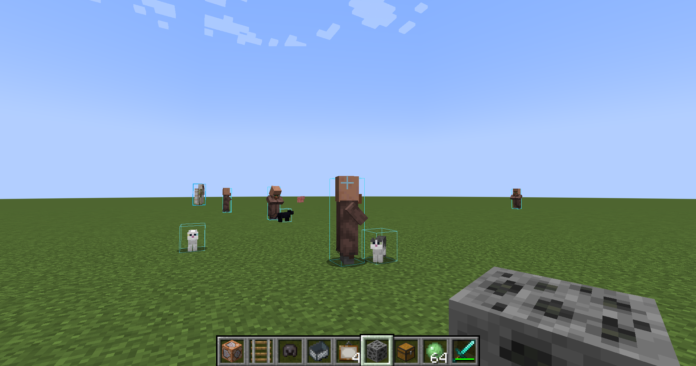
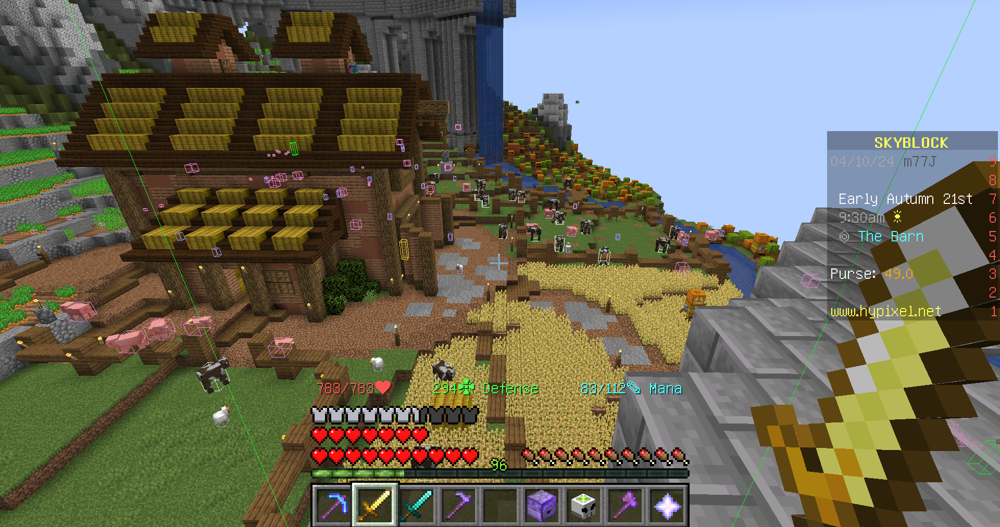

# Entity XRay based on Advanced Xray (Forge Edition for Minecraft 1.19.1)

Just like XRay Mod but for entities. I learned a lot from that code and because of laziness I build the two mod together so that you may find XRay mod in it.

## Key binding: 
H for GUI and J for toggling

## Todo:
Now it can only show the boundbox of all types of entities.Sry but I'm not familiar with openGL yet. So if you want to see entities through walls, there are good alternatives like Entity Outliner. In the future I want to add some fun feature which let me fight zombies easier in some server. (I'm not saying about hypixel.)

